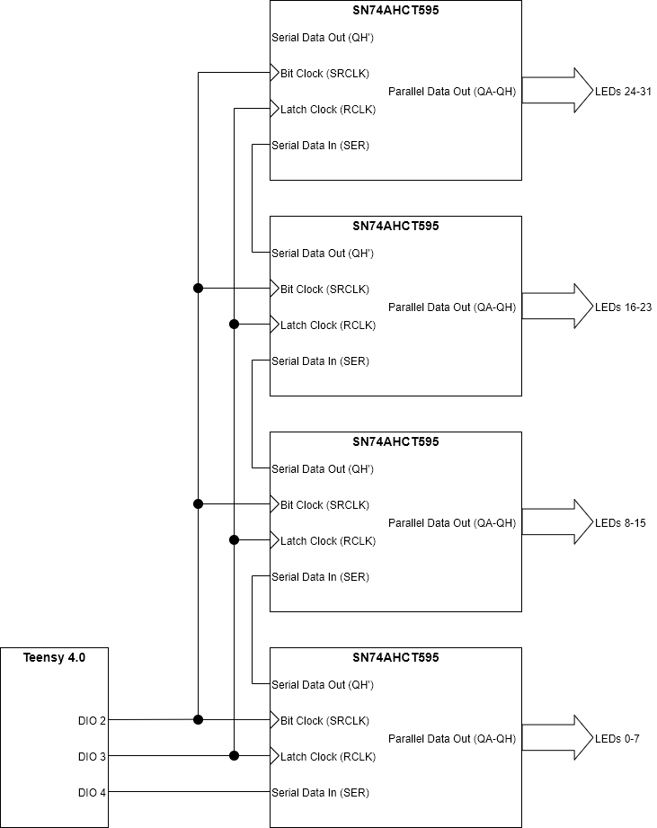
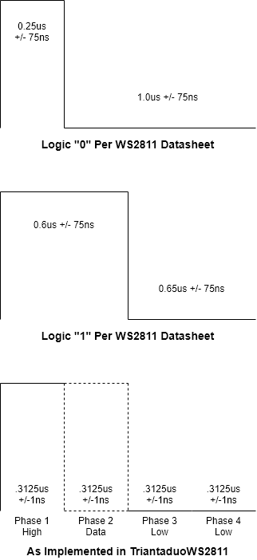
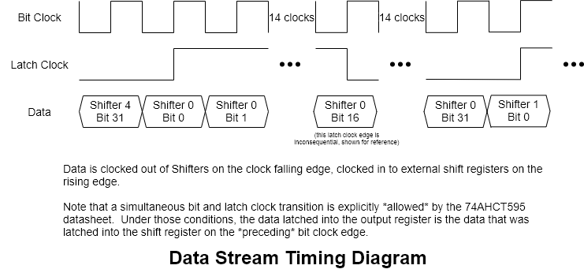
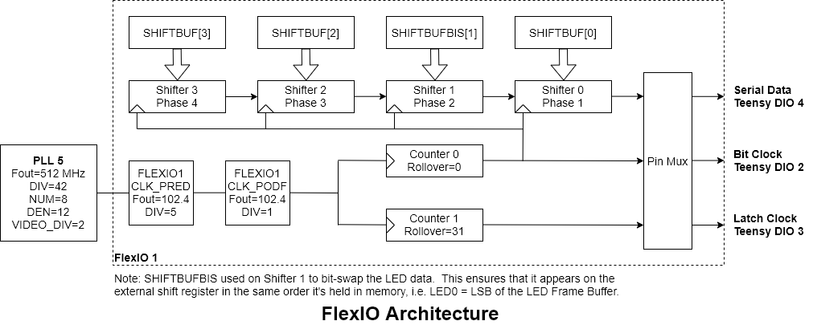
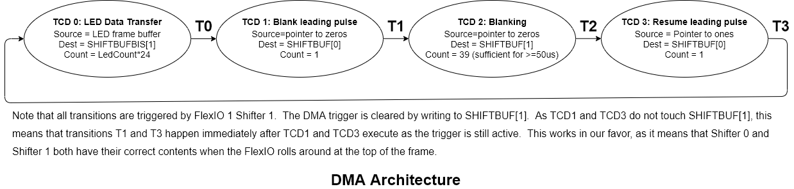
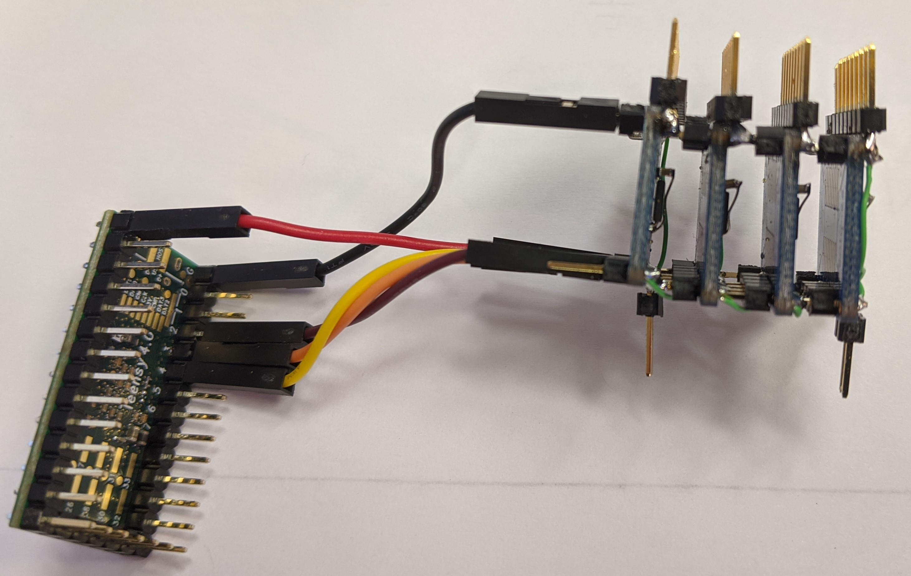
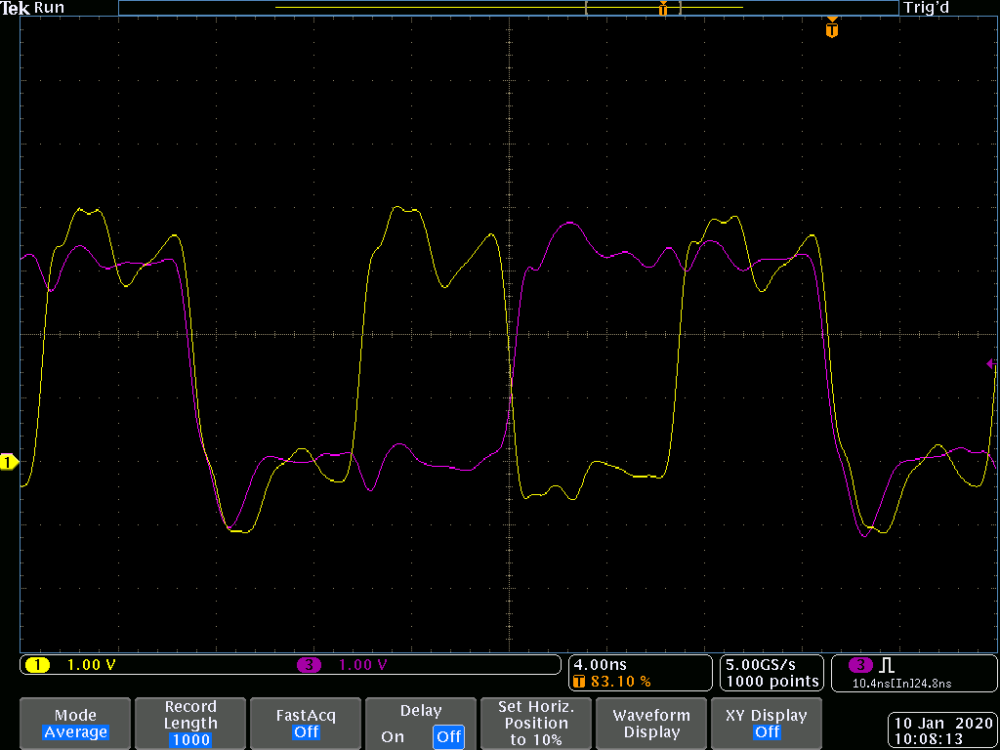
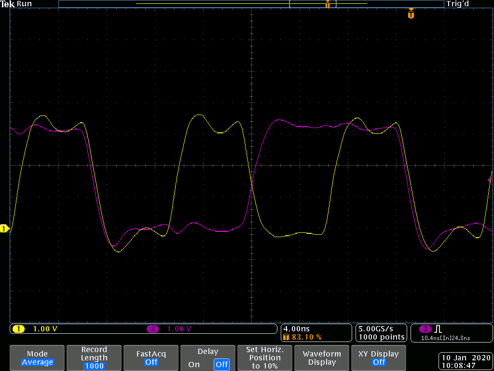
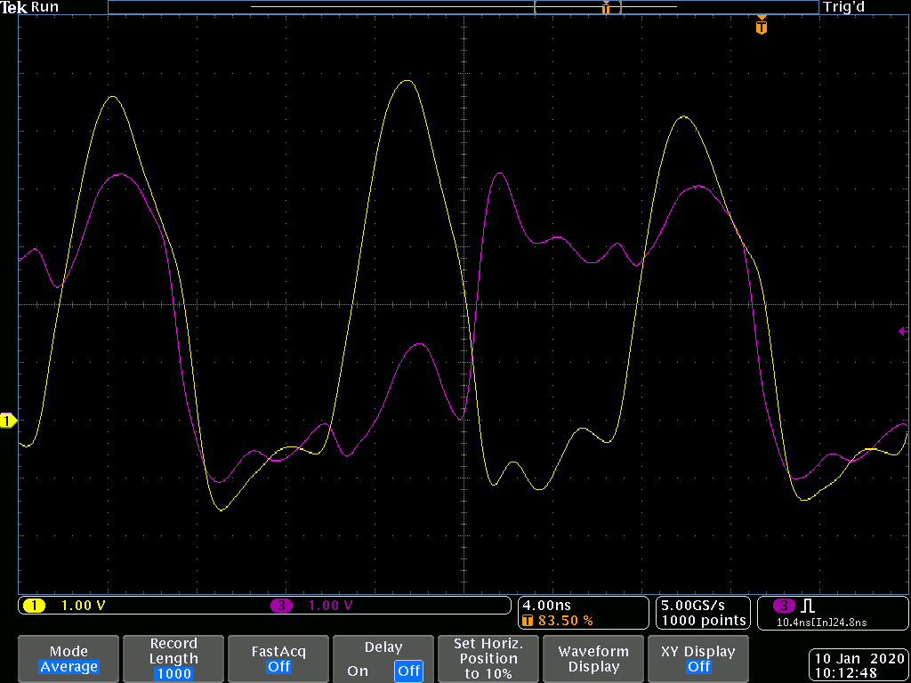
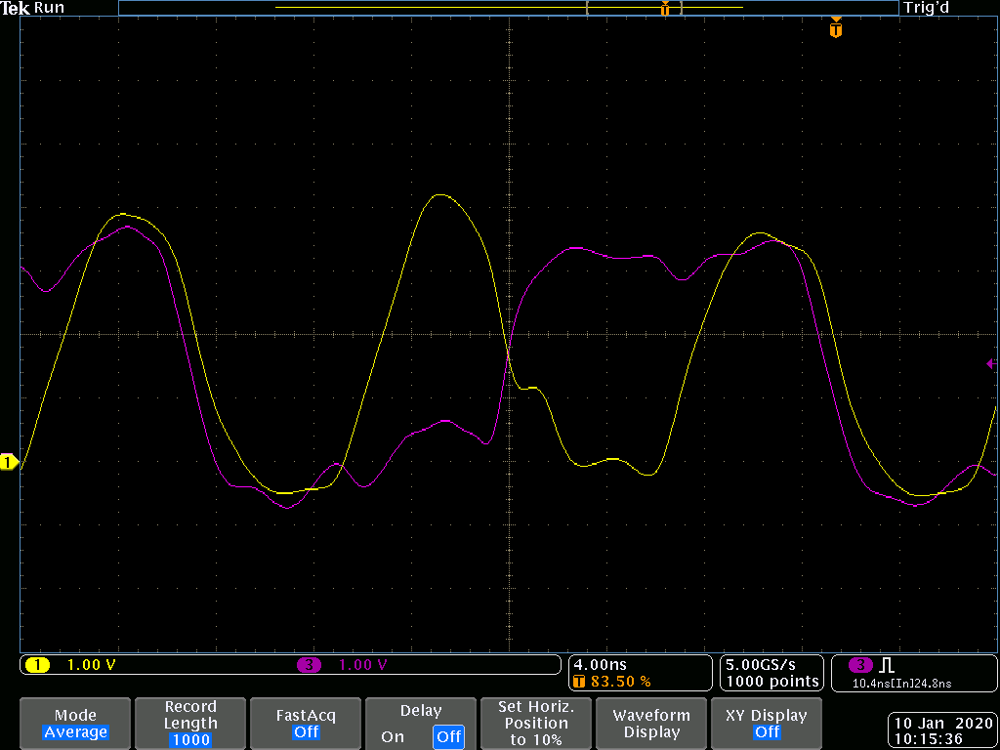

# TriantaduoWS2811
Triantaduo is a library to drive 32 WS28XX streams simultaneously from a Teensy 4.0.  The system uses external shift registers along with the FlexIO and DMA resources of the processor to minimize Teensy pin count and processor resource consumption.

## Introduction
When the Teensy 4.0 was released, my first thought was "What would a hobbyist do with all that horsepower?"  The obvious answer was: flash LEDs.  With this system you can flash a lot of LEDs, very fast.  How many and how fast?  That's a hard question.  The short answer is 1.065 million WS* LED updates per second, spread across 32 channels.  Give or take.  To put that in more practical terms, that's 32 channels of 1000 LEDs per channel at 33 frames per second.  Or 32 channels of 100 LEDs per channel at 330 frames per second.  You get the idea.

An arbitrary constraint I imposed on myself was to minimize pin count and processor overhead on the Teensy.  I settled for three Teensy pins and zero processor overhead through the magic of FlexIO and DMA by using external shift registers.  External component use was necessary anyway due to the need to translate from 3.3V to 5V to drive the LED strips.  The shift registers are 5V parts, so they accomplish that translation while also freeing processor resources

## Top Level Description
The following sections will detail the hardware and software architecture of the system.

### Electrical Elements
The system is straightforward, just a Teensy 4.0 and four cascaded shift registers.  The data moves relatively quickly, with a bit clock of 102.4 MHz.  This means that good layout practices are a must for the three high-speed, timing critical lines: bit clock, latch clock, and serial data.  AHCT logic is used for two reasons: it meets the speed requirement, and the outputs are natively 5V, so no need for level translation before sending the data off to the LED strings.

### Firmware
On the firmware side, the logic consists of two basic blocks within the RT1062 processor.  The first is a single FlexIO block, the second is a single DMA channel.  In both cases I've attempted to use the standard libraries for accomplishing these things, but in places I've had to get creative.  That's equally likely to be due to my own ignorance as it is some fundamental limitation of the library.

#### FlexIO
The FlexIO module in this processor is a real treat.  At the highest level, a FlexIO is a bunch of shift registers and timers tied to input and output pins on the microcontroller.  Through various register settings, one can implement a number of different serial and parallel interfaces operating at nearly any speed imaginable.  As long as that speed is less than 120 MHz.  In this design, I use the resources of a single FlexIO block, to wit: four shifters and two timers.

#### DMA
Ah, black magic it is.  Not really, Paul's library does a good job of insulating one from descending into Reference Manual madness.  I still went there, but mostly to scratch my own masochistic itch; and also because I like to know what's going on under the hood.  In this design I use a single DMA channel, along with the scatter/gather functionality and four Transfer Control Descriptors (TCDs), wrapped in the library's DMASettings object.

#### Honorable Mention: PLL5
Did I say DMA use sent one into Reference Manual hell?  Ha!  It's got nothing on the RT1062 PLL subsystems.  The only way I could get all that stuff to go was to use the clock tree generator provided by NXP and transfer all the register manipulation over to Arduino-land.  PLL5 is used to drive the clock to the FlexIO module that runs the show.

## Detailed Operational Description
Shown below is the anatomy of a WS2811 bit.  String together 24 of those and you have one LED's worth of data.  String together multiple LEDs' data, take a rest for a bit, and you have a frame.  Let's look at how the signal's generated:

I first need to point out that mine is not a novel approach, it's very similar in structure to OctoWS2811, and I owe Paul a debt of gratitude for inspiring this project.  In order to most closely replicate the datasheet waveforms, I divide a bit time into four equal phases.  The first is always high, the second depends on the data to be transmitted, and the last two are zeros.  On the processor side, each phase corresponds to a 32-bit shift register inside FlexIO 1, hereafter referred to "shifters".

To reconstruct a bit, first the data for each of the four phases is loaded into the on-chip shifters from their respective data registers.  This happens automatically as part of the FlexIO logic.  Immediately after the shifters are loaded, the FlexIO block issues a DMA trigger to reload the registers, and I'll address that in a bit.  Next we clock out each of those shifters in order, simultaneously clocking the data *in* to the off-chip shift registers, and latch each 32-bit word once it's complete.  The process repeats four times, once for each phase/shifter.  The FlexIO state machine keeps running constantly, there is no interruption to its trigger, ever.  All the rest is handled by DMA.

On the DMA end, we just need to keep feeding the FlexIO registers.  That's accomplished by grabbing a data word from the LED frame buffer and stuffing it into Shifter 1, to be clocked out during phase 2.  During the frame body, that's it.  Once the frame buffer has been expended we need to drop to zero for a time (>=50us) to reset the LED chain in preparation for the next frame.  In order to do this, we loop to a second DMA transaction through the scatter/gather process.  That transaction forces zeros into the Phase 1 shifter (Shifter 0), then moves on to another transaction that dumps zeros into the Phase 2 shifter.  This transaction repeats multiple times, which is what determines the inter-frame time.  Once that transaction has run its course, we move on to a transaction that pushes all 1s into the Phase 1 shifter, and finally we jump back to our main transaction that stuffs LED data into the Phase 2 register.

There's also a provision in the system to accommodate multiple frame buffers and to switch between them during the blanking time between frames.  This is accomplished by setting the "Interrupt at end of transaction" bit in the second DMA transaction, the one that sets the Phase 1 shifter to all zeros.  When that interrupt fires, the ISR changes the pointer in transaction 0 (the main data loop) to point to the new frame buffer.  The ISR then disables transaction 1's interrupt at end bit and returns.  No other interrupts will be issued unless the frame buffer is changed again.

That's really about it.

# Testing

A wise man once said "good layout practices are a must."  Oh wait, that was me, shortly before saying "Hold my beer!"  Because nothing beats trying to debug software with questionable hardware, I threw caution to the wind and stacked up four breakout boards to make a large enough shift register to test my code. Shockingly, it worked pretty well.

This is one data transition on the Teensy alone, without the pile of shift registers attached.  Adjusting the drive strength (DSE) from 1 (above) to 6 (below) helped significantly.

And with the shift registers attached:

I should also point out that I'm not exactly using great 'scope hygiene here, so the actual waveforms are probably better than they look here.  I'm using the alligator clip grounds, which are a major no-no when you want to examine nanosecond rise times.  Look, man, the LEDs flash when they're supposed to and don't when they aren't, so I'mma call it good for now.
